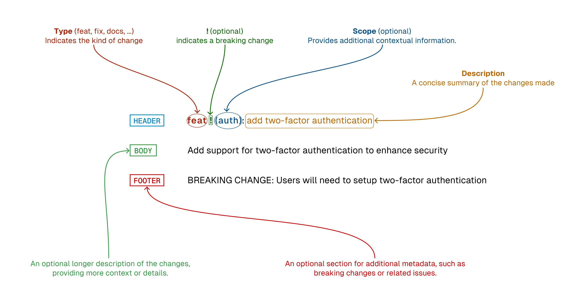

# Where to ask Questions?

Each project is related to a Youtube video : https://www.youtube.com/@LesMainsDansLeCode

Note that some projects can be available on **Github before the video** is available on social networks. \
_For example: if the project is presented at "physical" technical events, video content will always be available later._

**Questions** should mainly be **posted as comments** \
So, all answers can then be used to provide additional information and/or corrections for all other viewers.

# How Can I Contribute?
If you want to contribute, please follow **OpenSource principles** :\
https://opensource.guide/how-to-contribute/

## Suggesting Enhancements
As for questions, it's better to make suggestions in social networks comments section.

## Pull Requests

Please follow these steps to have your contribution considered by the maintainers:

1. Follow all instructions in [the template](.github/PULL_REQUEST_TEMPLATE.md)
2. Labels must contain the **scope of the pull request** (as git commit : feat, fix, chore, ci...)
3. To simplify validation and reduce the risk, **large pull requests should be avoided**. \
As far as possible, it's better to make several small requests than one that contains everything.
4. After you submit your pull request, verify that all [status checks](https://help.github.com/articles/about-status-checks/) are passing 

What if the status checks are failing?
If a status check is failing, and you believe that the failure is unrelated to your change, please leave a comment on the pull request explaining why you believe the failure is unrelated. A maintainer will re-run the status check for you. If we conclude that the failure was a false positive, then we will open an issue to track that problem with our status check suite.

While the prerequisites above must be satisfied prior to having your pull request reviewed, the reviewer(s) may ask you to complete additional design work, tests, or other changes before your pull request can be ultimately accepted.

## Git Commit Messages

This project is using conventional commits: https://www.conventionalcommits.org/en/v1.0.0/

> "Having a story in your git log will make a huge difference in how you and others perceive your project. By taking great care in commit messages, as you do in your code, you will help to increase overall quality." - [Caleb Thompson](https://robots.thoughtbot.com/5-useful-tips-for-a-better-commit-message)
