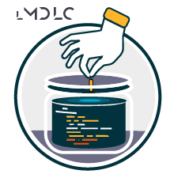

# mdlc-nodejs-demos

This repository contains a collection of NodeJs/Typescript demos presented in technical events and on the french YouTube channel 'Les Mains Dans Le Code' :
https://www.youtube.com/@LesMainsDansLeCode

## Projects / Components

### 👉 01-mongodb-stream-worker :

Related to the video : 🔜 _Not available yet_ 

This project is an example of a **worker that listens to a MongoDB Change Stream** to perform a simple action. \
See the project's [README.md](./apps/01-mongodb-stream-worker/README.md)

## Getting started (Developers)
See [DEVELOPERS.md](./DEVELOPERS.md)

## How to contribute
See [CONTRIBUTING.md](./CONTRIBUTING.md)

## Code of Conduct
See [CODE_OF_CONDUCT.md](./CODE_OF_CONDUCT.md)
